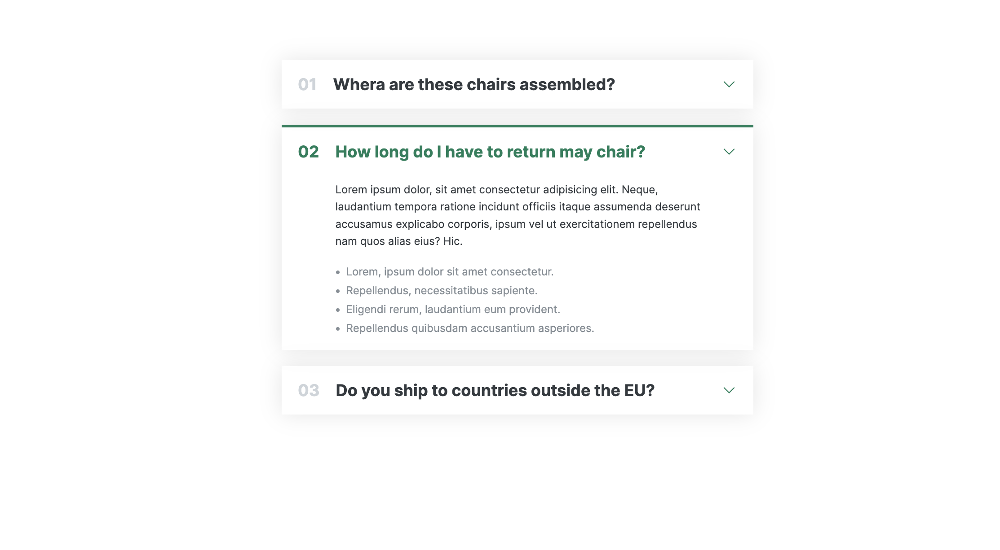
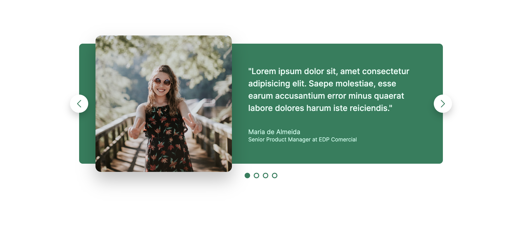
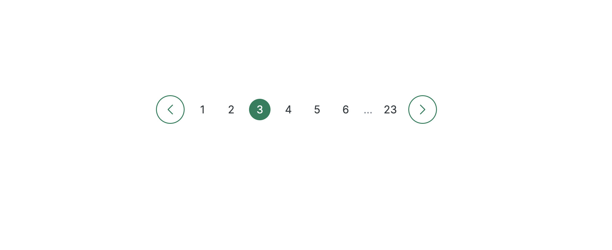
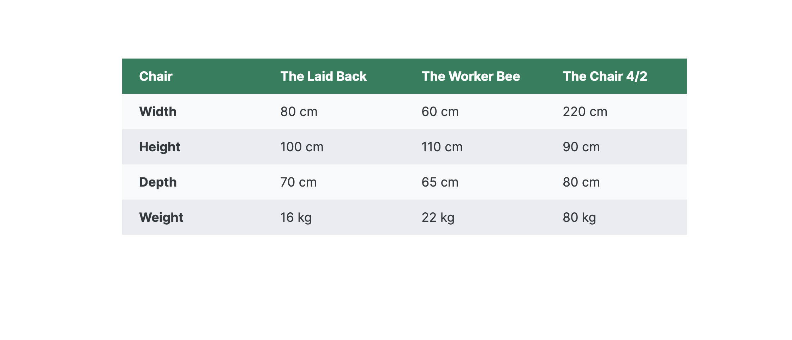

# HTML Components

These HTML component were made by learning purpose only, following tutorial [Build Responsive Real-World Websites with HTML and CSS](https://www.udemy.com/course/design-and-develop-a-killer-website-with-html5-and-css3/).

## 🌟 About

This is my HTML and CSS learning small projects.

## 🎯 Project features/goals

-   Grid
-   Flex
-   Element components
-   Section components

# Print Screens

## 🧰 Accordion

## 🧰 Basic APP Layout

## 🧰 Carousel

## 🧰 Hero Section

## 🧰 Pagination

## 🧰 Table

## 🥸 Authors

Saulius: [Github](https://github.com/sgrazys)

## 🔗 Other resources

## 📫 Reach me

-   [LinkedIn](https://www.linkedin.com/in/saulius-grazys/)

-   [Mail](mailto:s.grazys@gmail.com)
